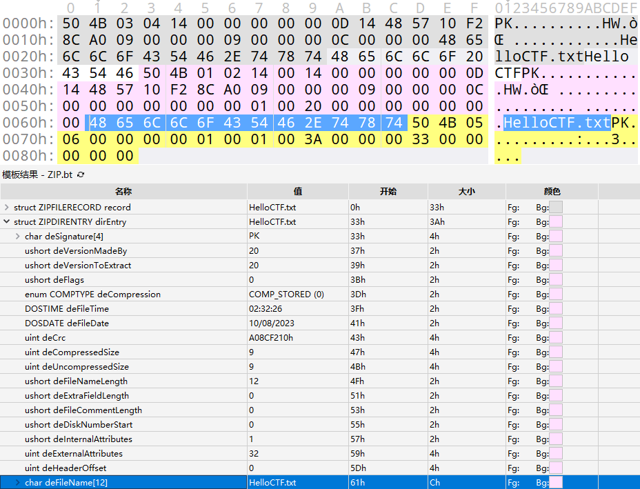
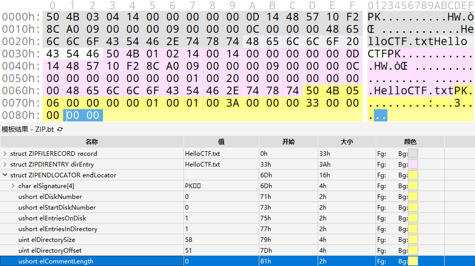
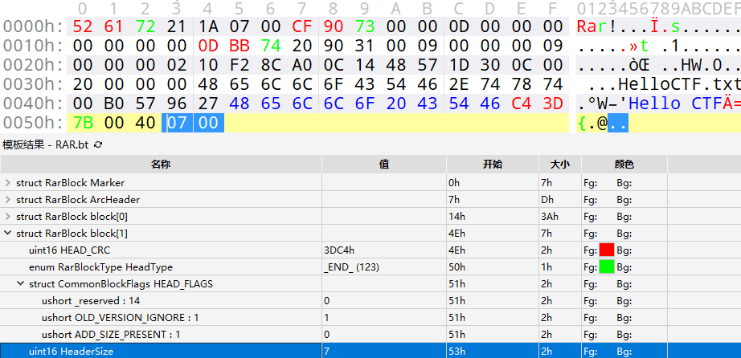
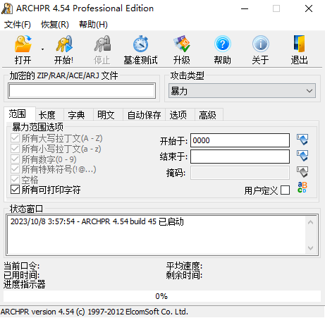
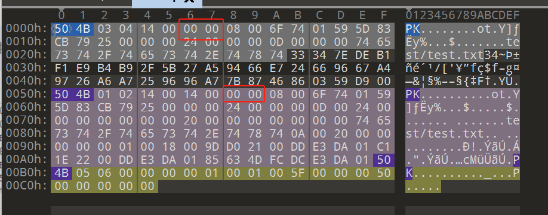
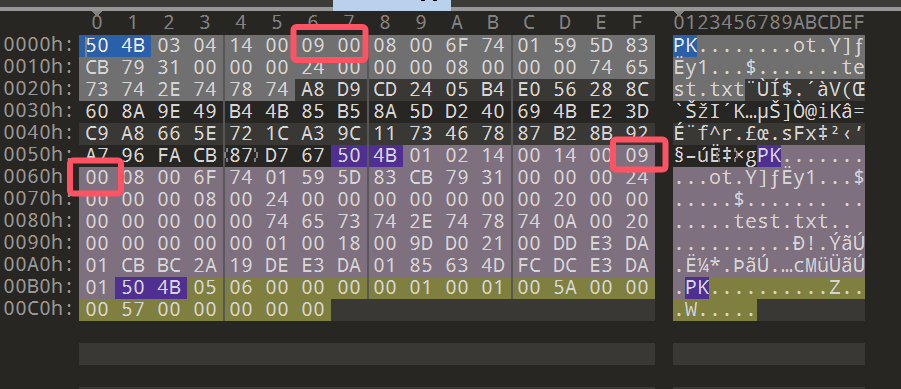
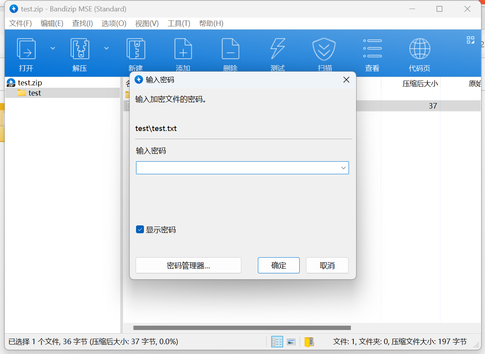
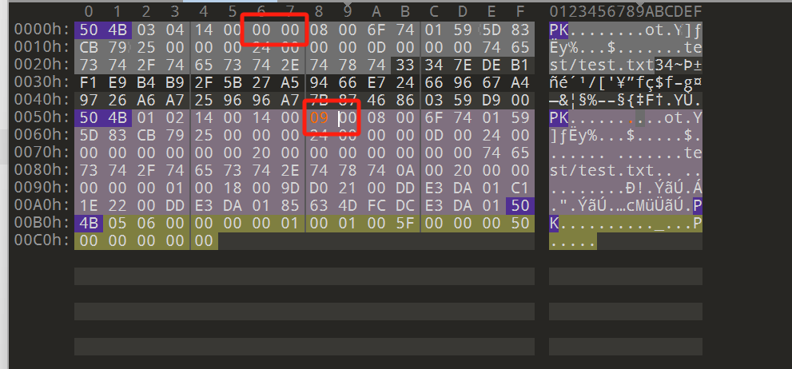

# 压缩包

## 文件结构

### .Zip

一个 ZIP 文件由三个部分组成:

**\+ 压缩源文件数据区**

{ width="85%" }  
 \- `local file header` 由固定值 `50 4B 03 04` 即 .zip 文件的魔法数字作为开始。  
 \- `file data` 记录相应压缩文件的数据  
 \- `data descriptor` 数据描述符用于标识该文件压缩结束，该结构只有在相应的 `local file header` 中通用标记字段的第 `3 bit` 设为 `1` 时才会出现，紧接在压缩文件源数据后。  
**\+ 压缩源文件目录区**

{ width="85%" }  
 \- `Central directory` 记录了压缩文件的目录信息，在这个数据区中每一条纪录对应在压缩源文件数据区中的一条数据。  
**\+ 压缩源文件目录结束标志**

{ width="85%" }  
 \- `End of central directory record(EOCD)` 目录结束标识存在于整个归档包的结尾，用于标记压缩的目录数据的结束。每个压缩文件必须有且只有一个 `EOCD` 记录。  

具体详细的结构可以参考下面 010Editor .zip 模板对照表.

??? note "010Editor .zip 模板对照表"
    ```
    + ZIPFILERECORD record # 压缩源文件数据区
        - char frSignature[4] # 压缩源文件标志
        - ushort frVersion # 压缩源文件版本
        - ushort frFlags # 压缩源文件标志 （有无加密，这个更改这里进行伪加密，改为01 00打开就会提示有密码了）
        - enum COMPTYPE frCompression
        - DOSTIME frFileTime # 压缩源文件时间
        - DOSDATE frFileDate # 压缩源文件日期
        - uint frCrc # 压缩源文件CRC32校验值
        - uint frCompressedSize # 压缩源文件压缩后大小
        - uint frUncompressedSize # 压缩源文件压缩前大小
        - ushort frFileNameLength # 压缩源文件名长度
        - ushort frExtraFieldLength # 压缩源文件扩展域长度
        - char frFileName[frFileNameLength] # 压缩源文件名
        - uchar frData[frCompressedSize] # 压缩源文件数据
    + ZIPDIRENTRY dirEntry # 压缩源文件目录区
        - char deSignature[4] # 目录标志
        - ushort deVersionMadeBy # 创建该条目的版本
        - ushort deVersionNeeded # 解压该条目所需的版本
        - ushort deFlags # 标志位
        - enum COMPTYPE deCompression # 压缩方法
        - DOSTIME deFileTime # 最后修改时间
        - DOSDATE deFileDate # 最后修改日期
        - uint deCrc # CRC32校验值
        - uint deCompressedSize # 压缩后的大小
        - uint deUncompressedSize # 压缩前的大小
        - ushort deFileNameLength # 文件名长度
        - ushort deExtraFieldLength # 扩展域长度
        - ushort deFileCommentLength # 文件评论长度
        - ushort deDiskNumberStart # 起始磁盘编号
        - ushort deInternalAttributes # 内部属性
        - uint deExternalAttributes # 外部属性
        - uint deRelativeOffset # 该条目在 ZIP 文件中的偏移位置
        - char deFileName[deFileNameLength] # 文件名
        - char deExtraField[deExtraFieldLength] # 扩展域
        - char deFileComment[deFileCommentLength] # 文件评论
    + ZIPENDLOCATOR endLocator # 压缩源文件目录结束标志
        - char elSignature[4] # 结束标志
        - ushort elDiskNumber # 当前磁盘编号
        - ushort elStartDiskNumber # 目录开始的磁盘编号
        - ushort elEntriesOnDisk # 当前磁盘上的条目数量
        - ushort elEntriesTotal # 总条目数量
        - uint elSizeOfDirectory # 目录的总大小
        - uint elOffsetOfDirectory # 目录开始的偏移位置
        - ushort elCommentLength # 注释长度
        - char elComment[elCommentLength] # 注释
    ```

### .RAR

一个 RAR 文件主要由以下部分组成:

**+ 标记块和压缩文件头块**


\- `RAR 文件头` 为 `0x 52 61 72 21 1A 07 00`，是RAR文件的魔法数字作为开始。

**+ 文件头块**


\- `File Header` 包含多个字段，如文件CRC、压缩方法、文件大小、文件名等等。

**+ 结尾块**



\- `Terminator` 是每个RAR文件的结尾块，其结构固定，主要用于标记RAR文件的结束。

## 爆破攻击

最简单，最直接的攻击方式，适合密码较为容易或已知密码范围 / 格式，包括字典爆破、掩码攻击等。

### ARCHPR



### Ziperello


### fcrackzip

**Usage**

```
USAGE: fcrackzip
          [-b|--brute-force]            use brute force algorithm
          [-D|--dictionary]             use a dictionary
          [-B|--benchmark]              execute a small benchmark
          [-c|--charset characterset]   use characters from charset
          [-h|--help]                   show this message
          [--version]                   show the version of this program
          [-V|--validate]               sanity-check the algorithm
          [-v|--verbose]                be more verbose
          [-p|--init-password string]   use string as initial password/file
          [-l|--length min-max]         check password with length min to max
          [-u|--use-unzip]              use unzip to weed out wrong passwords
          [-m|--method num]             use method number "num" (see below)
          [-2|--modulo r/m]             only calculcate 1/m of the password
          file...                    the zipfiles to crack
```

 **实例**

暴力破解 hello.zip ，密码为数字+大小写字母，长度为1-10

```
fcrackzip -b -c 'aA1' -l 1-10 -u hello.zip
```

暴力破解 ctf.zip ，密码为纯数字，长度为3

```bash
fcrackzip -b -c'1' -l 3 -u ctf.zip 
```

用 rockyou.txt 作为字典爆破 flag.zip

```
fcrackzip  -D -p rockyou.txt -u flag.zip
```

## 伪加密

伪加密就是通过修改压缩文件的加密标志位，使得压缩文件在解压时不需要密码。

### ZIP

先介绍一下关于zip伪加密的小知识点~

zip伪加密是在文件头的加密标志位做修改，进而再打开文件时识被别为加密压缩包
一个 ZIP 文件由三个部分组成：
压缩源文件数据区+压缩源文件目录区+压缩源文件目录结束标志

压缩源文件数据区
数据区主要记录了压缩前后文件的元数据以及存放压缩后的文件，记录格式如下：

```bash
第0~3个字节：50 4B 03 04，代表了文件头标志
第4~5个字节：14 00，代表了解压文件所需的pkware版本
第6~7个字节：00 00，代表了全局方式位标记（用来判断有没有加密）
第8~9个字节：08 00，代表了压缩方式
第10~11个字节：1D 9B，代表了最后修改文件的时间
第12~13个字节：3D 56，代表了最后修改文件的日期
第14~17个字节：5A 48 63 5C，是zip文件的crc-32校验值
第18~21个字节：77 00 00 00，是文件压缩后的尺寸
第22~25个字节：B1 00 00 00，是文件未压缩前的尺寸
第26~27个字节：10 00，代表文件名长度
第28~29个字节：00 00，代表扩展记录长度
```

压缩源文件目录区

压缩源文件目录区是由一系列压缩源文件目录记录所组成，一条压缩文件目录记录对应数据区中的一个压缩文件记录，压缩源文件目录记录由以下部分构成：

```bash
1、第0~3个字节：50 4B 01 02，代表了目录文件头标记

2、第4~5个字节：02 3F，代表了压缩使用的pkware版本

3、第6~7个字节：14 00，代表了解压文件所需的pkware版本

4、第8~9个字节：00 00，代表了全局方式位标记（用来判断是否为伪加密）

5、第10~11个字节：08 00，代表了压缩方式

6、第12~13个字节：1D 9B，代表了最后修改文件的时间

7、第14~15个字节：3D 56，代表了最后修改文件的日期

8、第16~19个字节：5A 48 63 5C，是zip文件的crc-32校验值

9、第16~19个字节：77 00 00 00，是文件压缩后的大小

10、第24~27个字节：B1 00 00 00，是文件未压缩前的大小

11、第28~29个字节：10 00，代表文件名长度

12、第30~31个字节：00 00，代表扩展字段长度

13、第32~33个字节：00 00，代表文件注释长度
```

压缩源文件目录结束标志

```bash
1、第0~3个字节：50 4B 05 06，代表目录结束标记

2、第4~5个字节：00 00，代表当前磁盘编号

3、第6~7个字节：00 00，代表目录区开始磁盘编号

4、第8~9个字节：01 00，代表本磁盘上纪录总数

5、第10~11个字节：01 00，代表目录区中纪录总数

6、第12~15个字节：62 00 00 00，代表目录区尺寸大小

7、第16~19个字节：A5 00 00 00，代表目录区对第一张磁盘的偏移量

8、第20~21个字节：00 00，代表zip文件注释长度
```
#### 判断加密方式
在了解了ZIP的构成以后可以发现识别一个zip文件是否加密主要是看压缩源文件数据的全局方式位标记和压缩源文件目录区的全局方式位标记，关键操作在其中的全局方式标记的第一字节数字的奇偶上，其它的不管为何值，都不影响它的加密属性。通常全局方式位标记为2 bytes长度，第一字节数字为偶数表示无加密，例如：00,02,04等；为奇数表示有加密，例如01,03,09等。
##### 无加密
无加密的zip压缩包压缩源文件数据区的全局加密应当为00 00，且压缩源文件目录区的全局方式位标记也为 00 00。


##### 真加密
真加密的zip压缩包压缩源文件数据区的全局加密应当为09 00，且压缩源文件目录区的全局方式位标记也为 09 00。


##### 伪加密
伪加密的zip压缩包压缩源文件数据区的全局加密应当为09 00，且压缩源文件目录区的全局方式位标记也为 00 00或者01 00。





### RAR

## 明文攻击

## CRC32碰撞
